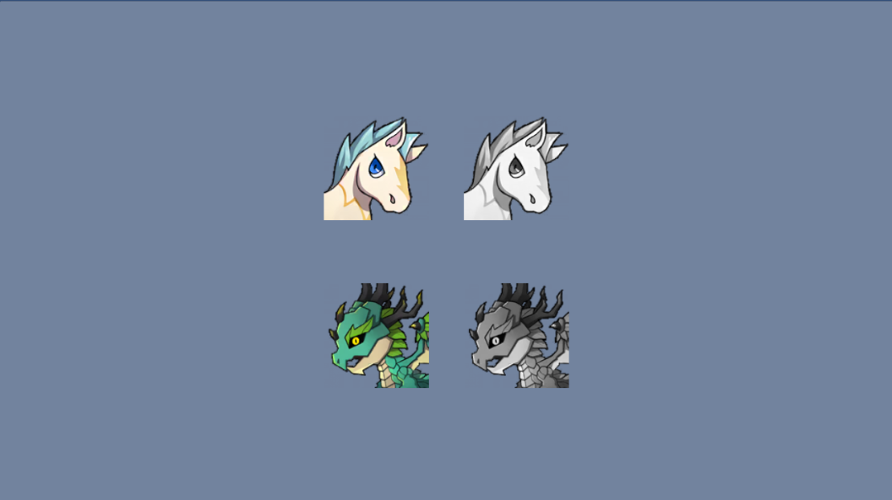
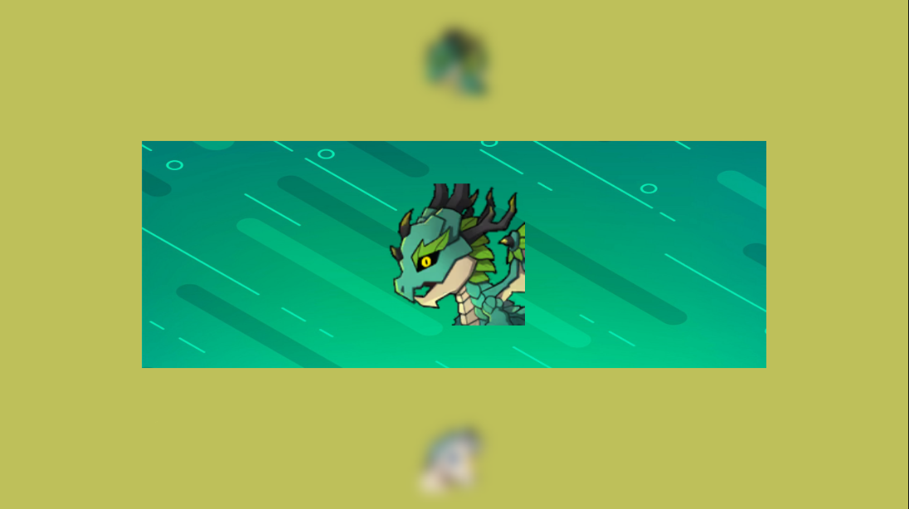
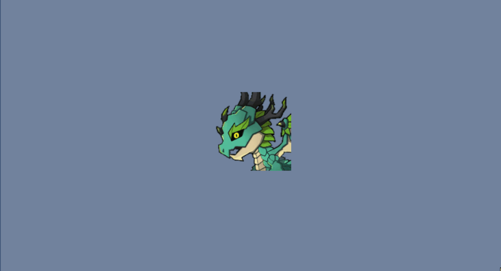
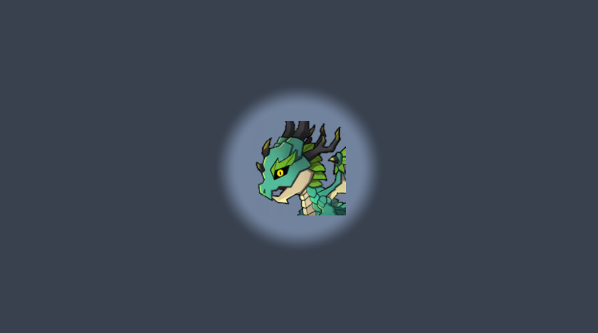
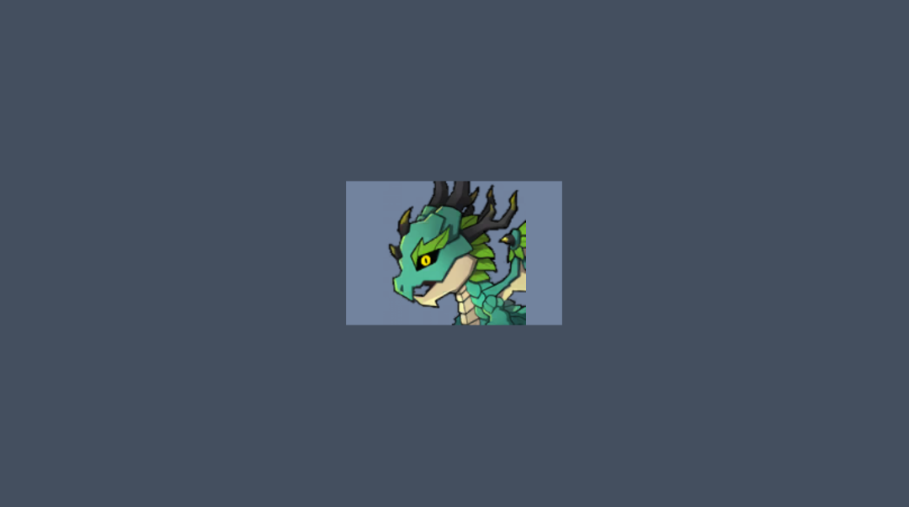
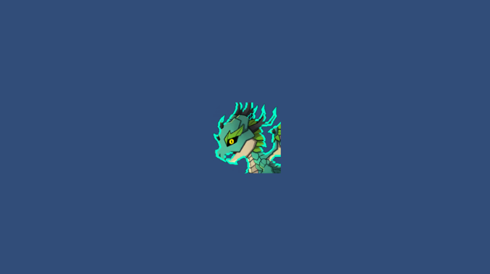

# Unity 2D Shaders

## Install Package

Open menu `"Window/Package Manager"` with your unity editor. Add package from git URL:

```
https://github.com/IndieGames-CN/unity-2d-shaders.git
```

## UI

* [UI Gray](./UI/Gray/Shaders/UIGray.shader)


* [UI Blur](./UI/Blur/Shaders/UIBlur.shader)


* [UI Circle Mask](./UI/Masks/Shaders/CircleMaskShape.shader)


* [UI Rect Mask](./UI/Masks/Shaders/RectMaskShape.shader)



## Sprites

* [Outline](./Sprite/SpriteOutline.shader)
